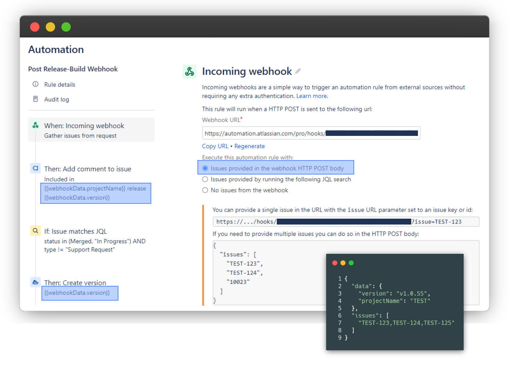

# create-jira-release (GitHub Action)

[](https://github.com/GeoWerkstatt/create-jira-release/actions/workflows/release-new-action-version.yml)

Creates a new Jira release for a specific Jira project and assigns all relevant* Jira issue numbers to it.  
\* All Jira issue numbers (e.g. TEST-123) in commit messages since last Git tag.

## Prerequisites

In order to be able to use this GitHub Action, a custom Jira automation rule needs to be created first. Please refer to the screenshot below for the most important settings.



## Usage

See [action.yml](action.yml)

```yaml
steps:
- uses: actions/checkout@v2

- uses: GeoWerkstatt/create-jira-release@v1
  with:
    jira-project-key: 'TEST'
    jira-automation-webhook: ${{ secrets.JIRA_AUTOMATION_WEBHOOK }}
    build-version: v${{ env.VERSION }}
```

## Options

| key                       | description                           | required |
| ------------------------- | ------------------------------------- | -------- |
| `jira-project-key`        | Jira project identifier (e.g. _TEST_) | true     |
| `jira-automation-webhook` | Jira automation webhook url           | true     |
| `build-version`           | Version identifier                    | true     |

## Secrets

| key                               | description                                                                                                         | required |
| --------------------------------- | ------------------------------------------------------------------------------------------------------------------- | -------- |
| `secrets.JIRA_AUTOMATION_WEBHOOK` | Can be obtained or regenerated in the _Incoming webhook_ automation step of the corresponding Jira automation rule. | true     |

## Publish new GitHub Action version

A new GitHub _pre-release_ is created [automatically](./.github/workflows/create-new-pre-release.yml) if there are new changes on the `main` branch. Uncheck _This is a pre-release_ in the _Edit_-Section for a specific pre-release in order to [update](./.github/workflows/release-new-action-version.yml) a major tag (e.g. v1) to point to the latest release. A major tag from the latest released tag is created automatically if a corresponding major tag doesn't exist already.

## License

The scripts and documentation in this project are released under the [MIT License](LICENSE)
